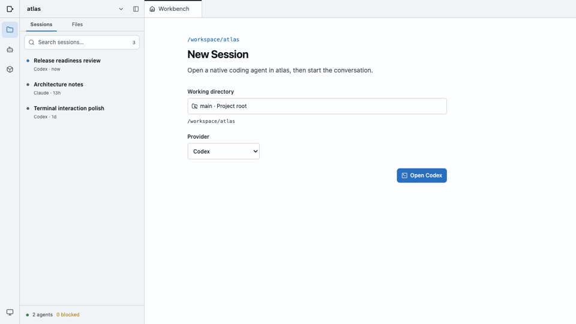

# Herdr Roam

Herdr Roam is a local personal AI software studio for coordinating Codex and Claude agents managed by [Herdr](https://herdr.dev).



It keeps active work, durable conversation history, project files, reusable Skills, and native agent terminals in one focused interface. Herdr continues to own processes and PTYs; Herdr Roam provides the coordination and reading layer above them.

## What it does

- Organizes local work by Git project and worktree.
- Starts native Codex and Claude agents in a selected working directory.
- Shows active agents across projects and opens their native terminal when interaction is needed.
- Reads resumable Codex and Claude Session history without attaching to a process.
- Browses project files with dedicated Markdown, source code, HTML, and image views.
- Surfaces existing project and user-level Skills without introducing another format or registry.
- Leaves task tracking in external systems such as GitHub Issues.

## Requirements

- Node.js 24
- pnpm 10
- Herdr 0.8.x
- An installed and authenticated Codex or Claude CLI

Herdr Roam currently supports one local user and one local host. It is designed to bind to loopback and does not provide authentication for public or shared-network deployment.

## Run from source

```bash
git clone https://github.com/bencode/herdr-roam.git
cd herdr-roam
pnpm install --frozen-lockfile
pnpm build
```

Start the Herdr server in one terminal:

```bash
herdr server
```

Then start Herdr Roam:

```bash
pnpm start
```

Open <http://127.0.0.1:4310>.

## Development

With the Herdr server running, start the API server on port `4311` and the Vite app on port `4310`:

```bash
pnpm dev
```

Run the project checks with:

```bash
pnpm lint
pnpm typecheck
pnpm test
pnpm build
```

## Documentation

The [project documentation](docs/README.md) covers the product scope, system architecture, project routing, Herdr runtime integration, and Workbench interaction model.

## Status

This is an early, source-only preview. Herdr Roam intentionally does not own the Herdr server process, provide a remote multi-user service, replace native agent CLIs, or maintain a separate task database.

## License

[MIT](LICENSE)
